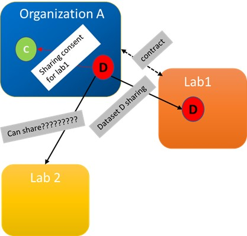

# ReasoningExample
 Reasoning to infer new statements
 
#Use Case

•	Organization A has a dataset (D) and it is obliged to share data for research purpose. 
•	In order to share dataset (D), organization A has received consent (C) for data subjects in order to share with research lab (lab 1)
•	Later lab 2 want to acquire this data for research purpose (Assumption: Lab 2 research work is like lab 1)
Question: How we can represent this formalism for the reasoning?
Solution: 
Step:1 Represent the situation using provenance in RDF/OWL (this is called model or dataset)
Step: 2 Develop the user defined rules (this is called rules set)
Step: 3 Develop code to infer the situation  
